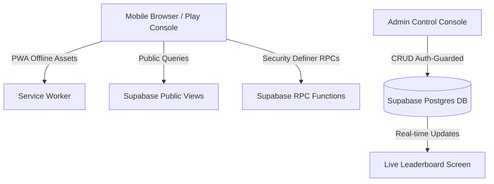
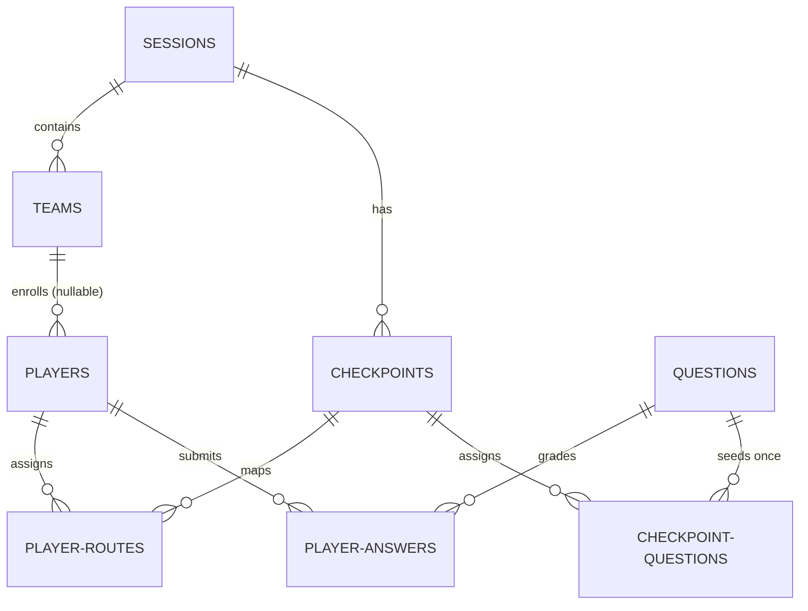

# Quest 404 — Core Brain & Codebase Architecture

This document serves as the central documentation for **Quest 404**, detailing its architecture, database design, gameplay logic, security model, identified bugs, and a step-by-step resolution plan.

---

## 1. System Architecture & Tech Stack

Quest 404 is a serverless, real-time campus scavenger hunt and cybersecurity quiz portal designed for mobile devices.



*   **Frontend:** Single-page style interface using Vanilla HTML5, CSS (with custom design system CSS custom properties), and ES Modules JavaScript.
*   **Database & Backend:** Supabase (PostgreSQL) handles database storage, administrative user authentication, and real-time subscription channels.
*   **Offline Support:** Standard PWA configuration with a Service Worker (`sw.js`) and `manifest.json` caching layout pages and core styling.
*   **Redirections & Build:** Configured for Netlify (`netlify.toml` and `inject-env.js`) for continuous deployment and environment variable injection.

---

## 2. Database Schema & Relationships

The database is structured to separate admin-only information (such as questions and answers) from public telemetry, enforcing security using Row Level Security (RLS) and Postgres RPC functions.



### Core Tables
1.  **`sessions`**: Manages hunt sessions. Statuses are `draft`, `active`, and `completed`.
2.  **`teams`**: Groups of players mapped to a session.
3.  **`checkpoints`**: Physical hunt nodes. Stores locations, hints, and unique `qr_identifier` hashes.
4.  **`players`**: Participants linked to a session, with `access_token` (`PL-XXXX-XXXX`). `team_id` is nullable to support self-registration standby.
5.  **`questions`**: Complete question bank (admin-only). Contains type (`mcq` or `text`), options, correct `answer` string, and base64 encoded `attachments`.
6.  **`player_routes`**: Stores the checkpoint visitation sequence for each player.
7.  **`player_answers`**: Holds graded player submissions.
8.  **`checkpoint_questions`**: Shared questions seeded per checkpoint. When the first player arrives at a checkpoint, a random set of active questions is selected and seeded for that checkpoint, making them uniform for all subsequent players visiting that checkpoint.
9.  **`player_checkpoint_questions`**: Copy of the seeded questions assigned to a specific player for grading checks.

---

## 3. Core Logic & Workflows

### A. Player Registration & Team Placement
*   Players register on the landing page [index.html](file:///E:/Quest%20Hunt/index.html) by entering a valid `Session ID` and a unique name.
*   A secure player token (`PL-XXXX-XXXX`) is generated and saved in local storage.
*   If the session is in `draft` status or if their team is `Unassigned`, they are redirected to a standby waiting screen in [play.html](file:///E:/Quest%20Hunt/play.html).
*   Using real-time listeners on the `players` and `sessions` tables, the screen automatically transitions into the active game console as soon as an admin places them on a team and starts the session.

### B. Route Generation
*   Routes determine the order in which players visit checkpoints.
*   In **Random Shuffling** mode, checkpoints are shuffled independently for each player, dispersing crowds across the campus.
*   In **Manual Mode**, admins drag and drop checkpoints to define a custom path for a player.

### C. Node Verification & Quiz Challenges
*   When a player locates a physical checkpoint, they click **Scan Node** in [play.html](file:///E:/Quest%20Hunt/play.html) which starts the `html5-qrcode` camera scanner.
*   If the scanned code matches the current checkpoint's `qr_identifier`:
    1.  The database assigns the checkpoint-allocated questions (seeding them randomly from the database if they are the first player to arrive at that checkpoint).
    2.  The screen transitions to [screen-questions](file:///E:/Quest%20Hunt/play.html#L101-L121) where player-specific public questions (excluding the answer field) are rendered.
*   The player fills out answers and clicks **Transmit Answers**.

### D. Verification & Grading (Secure RPCs)
*   Submissions are graded securely via the database RPC function `submit_checkpoint_answers`.
*   The RPC checks if the game is active, if the timer is still running, and verifies that the player is indeed submitting for their assigned checkpoint.
*   It compares submissions case-insensitively, records the results in `player_answers`, updates `player_routes.is_completed = true` for that node, and updates `players.current_checkpoint` to the next route order index.

---

## 4. What Is Broken & Architectural Flaws

During a code review of the schema and Javascript modules, the following bugs and design flaws were identified:

### 1. Game Completion Infinite Loop (Critical)
*   **The Bug:** In [schema.sql](file:///E:/Quest%20Hunt/sql/schema.sql#L228-L240), the RPC function `get_or_create_player_state` resets the player's `current_checkpoint` back to Checkpoint 1 if it is null:
    ```sql
    IF v_player.current_checkpoint IS NULL THEN
      SELECT checkpoint_id INTO v_first_checkpoint
      FROM player_routes
      WHERE player_id = v_player.id
      ORDER BY route_order ASC
      LIMIT 1;
      ...
    ```
*   **The Cause:** When a player completes their last checkpoint, `submit_checkpoint_answers` correctly updates `current_checkpoint` to `null` to mark completion. However, on the very next state sync (which happens immediately after submission), `get_or_create_player_state` sees `current_checkpoint IS NULL` and resets it back to Checkpoint 1!
*   **Consequence:** Players are trapped in an infinite loop. They can never see the victory screen because the game resets them to Checkpoint 1, allowing them to re-submit answers infinitely.

### 2. Route Regeneration Progress Wipeout (High)
*   **The Bug:** In [routes.js](file:///E:/Quest%20Hunt/js/admin/routes.js#L218-L225), clicking **Auto-Generate Routes** executes a delete operation across all players in the session:
    ```javascript
    const { error: deleteErr } = await supabase
      .from('player_routes')
      .delete()
      .in('player_id', playerIds);
    ```
*   **Consequence:** If players are already mid-game and a new player registers, clicking "Auto-Generate Routes" will erase **all** existing route assignments and progress metrics for everyone in the session.
*   **Flaw:** There is no safety fallback to generate routes *only* for players who do not have one assigned yet.

### 3. Ticking Clock After Session Completion (Medium)
*   **The Bug:** In [schema.sql](file:///E:/Quest%20Hunt/sql/schema.sql#L170-L174), the `leaderboard_view` calculates `elapsed_seconds` based on `now()` when a team has not finished:
    ```sql
    case 
      when s.started_at is null then 0
      when ta.last_completion_time is null then extract(epoch from (now() - s.started_at))::integer
      else extract(epoch from (ta.last_completion_time - s.started_at))::integer
    end as elapsed_seconds
    ```
*   **Consequence:** If the admin terminates the session (setting status to `completed`), the leaderboard still uses `now()` for teams that haven't completed the hunt. This means their elapsed time keeps ticking upwards forever on the leaderboard screen even though the event is over.
*   **Flaw:** The `sessions` table lacks a `completed_at` timestamp column to freeze calculations.

### 4. No Safety Check for Missing Routes (Low)
*   **The Bug:** In [sessions.js](file:///E:/Quest%20Hunt/js/admin/sessions.js#L188-L232), `startSession` allows starting a game even if no player routes have been generated.
*   **Consequence:** If the admin starts the session without generating routes, players are presented with a blank waiting screen indefinitely, causing day-of-event confusion.

---

## 5. Resolution & Fix Implementation Plan

To address these flaws, the following changes should be implemented:

### Step 1: Fix the Game Completion Infinite Loop
Modify `get_or_create_player_state` in [schema.sql](file:///E:/Quest%20Hunt/sql/schema.sql#L228-L240) to query the first **uncompleted** checkpoint instead of the absolute first checkpoint:
```diff
  -- If current_checkpoint is null, find the first checkpoint on player's route
  if v_player.current_checkpoint is null then
    select checkpoint_id into v_first_checkpoint
    from player_routes
-   where player_id = v_player.id
+   where player_id = v_player.id and is_completed = false
    order by route_order asc
    limit 1;
```

### Step 2: Implement "Generate Missing Routes Only"
Modify [routes.js](file:///E:/Quest%20Hunt/js/admin/routes.js) to filter out players who already have route configurations:
1.  Query `player_routes` to see which player IDs already have records.
2.  Generate and insert routes only for the subset of players lacking them.
3.  Add a confirmation modal warning the admin of the difference between "Regenerate All" (destructive) and "Generate Missing" (safe).

### Step 3: Add `completed_at` to Sessions
1.  Add `completed_at` column to the `sessions` table in the database.
2.  Update [sessions.js](file:///E:/Quest%20Hunt/js/admin/sessions.js) to set `completed_at` to the current time when updating status to `'completed'`.
3.  Rewrite `leaderboard_view` in [schema.sql](file:///E:/Quest%20Hunt/sql/schema.sql) to use `s.completed_at` as the upper time boundary if the session is completed and the team hasn't completed all checkpoints.
